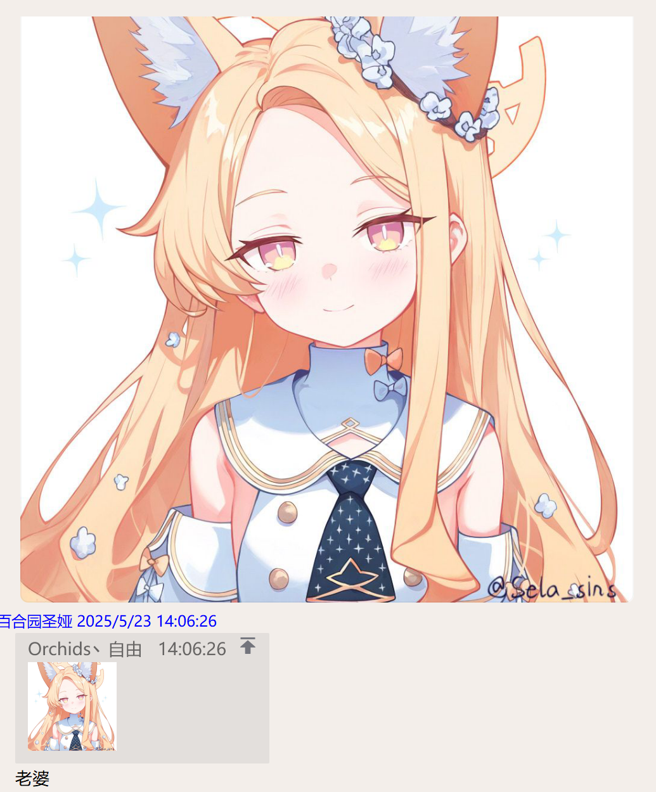
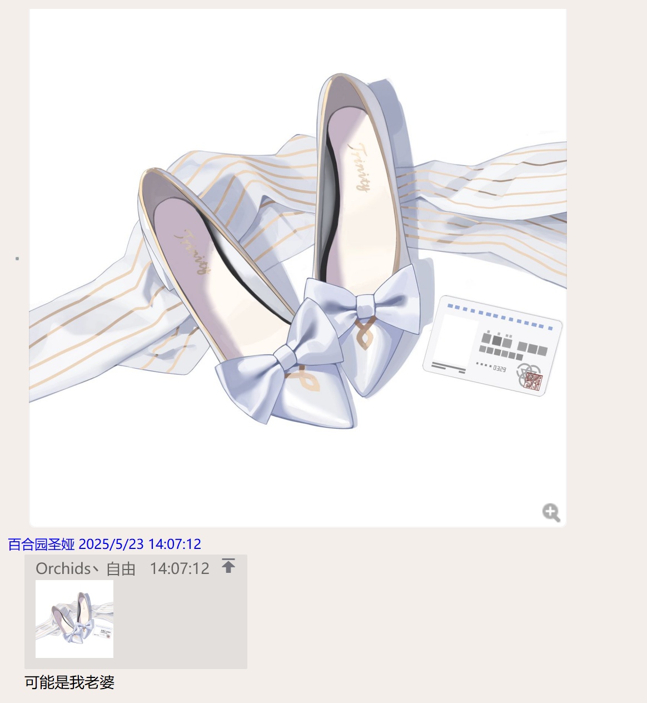
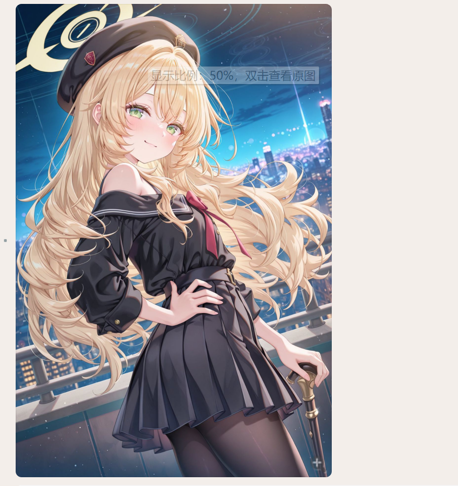
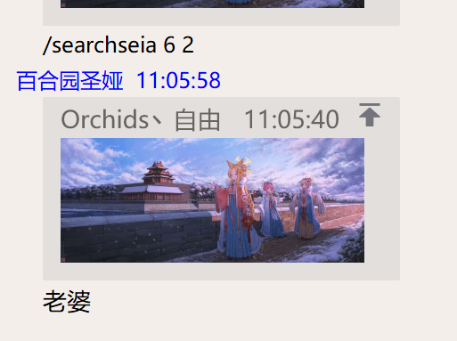

# astrbot_plugin_hinadetect

本插件用于检测接受到的图片是否包含 *空崎日奈* ，如果是，则会有对应回复，否则不会做出回应。
根据上游的seiadetect做出了必要的修改

## 模型来源
模型是我参考[spawner1145](https://github.com/spawner1145)的仓库[NailongRecognizeRL](https://github.com/spawner1145/NailongRecognizeRL)训练而来，使用了超过300张Seia的图片以及1k+张由我的QQbot接受到的各种图片训练而来。  
在训练过程中，由于数据集问题，我把搜集到的Seia的图片均左旋转，上下翻转并且作为数据集拿去训练。在我个人部署到自己的bot这段时间内，检测效果还可以。  
上游模型仓库地址：[SeiaDetectModel](https://github.com/orchidsziyou/SeiaDetectModel)
上游模型仓库地址：[HinaDetect](https://github.com/Sorasaki-mrdg/astrbot_plugin_hinadetect)

## 依赖
本插件使用了Aiocqhttp当中的内容，仅测试过Napcat，建议使用了Napcat的用户安装.  
本插件使用了onnxruntime库，请确保系统中已安装onnxruntime库。  
参考requirements.txt文件安装依赖库。

## 使用
只需要把本插件放到plugins目录下，重启bot即可。注意一定要安装好requirements当中的包才能正常使用。  

## 功能
### /searchhina a b (不加参数就默认都为2)
检测接受到的图片是否包含 *空崎日奈* ，不论是否包含，都会有对应回复。 
参数a和b分别表示图片分割的块数，a*b表示总的块数。  
例如：/searchhina 2 2  

### 自动检测发送的图片是否包含 *空崎日奈* ，只有包含才会有回复.

**注意** ：由于模型在插件启动之后就一直在加载了，因此会占用一定的内存（90M左右，加上插件本身的内存占用，大概100多MB的占用）。因此，建议在内存有一定富裕的情况下使用。  
**注意** ：如果机器性能较差，单张图片的检测时间可能会比较长，可能会有延迟。  
**注意** ：本插件只检测发送的图片，表情包（收藏的那种），gif，文件都不检测。  
**注意** ：为了性能考虑，在手动命令详细检测图片的时候，a*b的数值不允许超过16，否则不会执行。  

### 注意
**本插件只检测发送的图片，表情包（收藏的那种），gif，文件都不检测。**

## 当前问题
模型在识别Hina时有一定的误差，能检测出各种hina图片，包括手偶照片，存在很多认不出的情况
在遇到*玛丽*，_教授_，还有一些神秘*黄毛兽耳角色*的时候也会有反应导致误判。
当前的解决方案是：在每次检测完成后，返回一个得分，如果得分大于某个阈值（0.7），就认为是Seia。在得分为(0,0.7)之间的图片，会有另外一种回复。得分 <0时则不会有回应。

## 拓展
如果想要训练自己的模型，可以参考[spawner1145](https://github.com/spawner1145)的仓库[NailongRecognizeRL](https://github.com/spawner1145/NailongRecognizeRL)进行训练，也可以使用我那个仓库来训练。  
若使用我那个仓库来训练，只需要把数据集当中正样本放到train_positive当中，负样本放到train_negative当中，然后运行train01.py文件即可。把您训练好的模型放到本插件的目录下替换好文件名字即可。

# 更新：
2025/6/3 添加排除掉qq官方表情，否则会出错

2025/9/5 添加功能 /searchhina a b  把图片分割成a*b块，然后检测每块图片是否有hina，并返回结果。  

## 运行截图

没检测到的情况(无回应)  

详细检测图片的情况  

